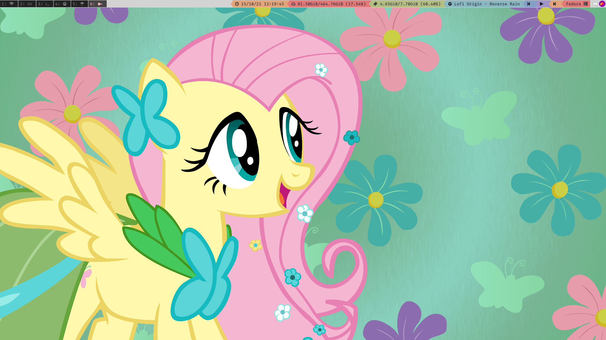

# i3wm Config

## Install
*NOTE: If you don't have <a href="https://github.com/tobi-wan-kenobi/bumblebee-status"> bumblebee-status </a> this config will not work

``
$ git clone https://github.com/picsacoder/my-i3wm-conf
``

``
$ cp -r my-i3-conf/i3/config .config/i3/config
``

You only need to press Win+R or Alt+R to reload your config and you should see something like this:

 </img>
